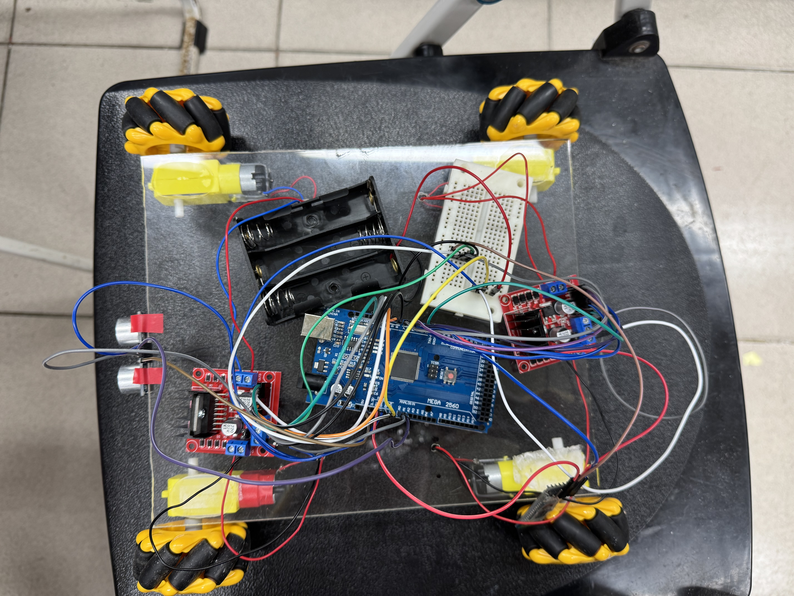

# Omnidirectional Mobile Robot Platform

**Course:** Robotics and Control Practice Project (Fall 2024)
**Institution:** National Taiwan Ocean University (NTOU)

## Overview
This project involves the design and implementation on an **omnidirectional mobile robot** capable of holonomic motion. The system integrated an **Arduino IDE**, **ultrasonic sensor** for obstacle avoidance, and a **Android Application** for wireless teleoperation via Bluetooth.

### System Block Diagram

## Demo

### 1. Holonomic Motion Test (Forward, Lateral, Rotational)
[Click to Watch on YouTube](https://youtube.com/shorts/gLr8NuW0tnE?feature=share)

### 2. Obstacle Avoidance Test
[Click to Watch on YouTube](https://youtube.com/shorts/wTYX9rH3BQc?feature=share)

## Key Features
* **Omnidirectional Mobility:** Utilized Mecanum wheels to achieve 3-DOF movement on a 2D plane.
* **Wirekess Teleoperation:** Real-time control via Bluetooth Serial Port Profile using the HC-06 module.
* **Safety Mechanism:** Integrated ultrasonic sensors (HC-SR04) to continually monitor the environment and trigger emergency stops within 20cm of the obstacle.

## System Architecture

### Hardware Tech Stack
* **Microcontroller:** Arduino Mega 2560
* **Actuators:** 4x DC TT-Motors with Gearbox
* **Drive System:** 4x Mecanum Wheels (Roller angle: 45°)
* **Sensors:** HC-SR04 Ultrasonic Distance Sensor
* **Communnication:** HC-05 Bluetooth Module

### Software Logic
The control system operates on a loop that handles:
1. **Signal Parsing:** Decoding characters received from the Android App via Bluetooth (UART).
2. **Motor Mixing:** Converting the desired direction command into specific PWM signals for the four independent motors.
3. **Interrupt/Polling:** Checking sensor data to override user commands if an  obstacle is imminent.

## Kinematic Principle
The mecanum wheel allows for a force vector perpendicular to the wheel rotation. By combining the rotation directions of the four wheels, the robot creates a net force vector in any desired direction.
To achieve lateral movement (strafing), the wheels are driven in opposition:
* **Strafe Right:** Front-Left & Rear-Right (Forward) + Front-Right & Rear-Left (Backward)
* **Strafe Left:** Front-Left & Rear Right (Backward) + Front-Right & Rear-Left (forward)

*(Credit: Wikimedia)
## Gallery
Below is the finished prototype of the Mecanum Wheel Robot:
### Robot View (Front View)

### Robot View (Top View)

### Arduino Bluetooth Control App

